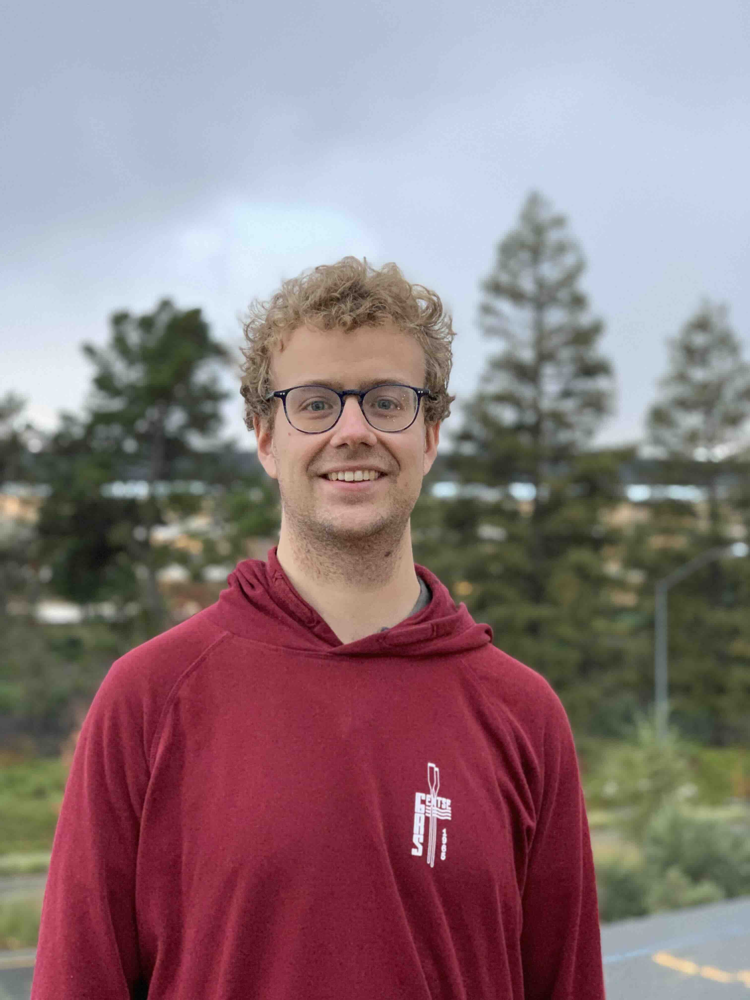

Welcome to my web page!

I am an assistant professor at the [Eindhoven University of Technology](https://www.tue.nl/) in the [Uncertainty in Artificial Intelligence Group](https://uai.win.tue.nl/).
<!--  -->

In 2020 – 2023 I was a research associate at the [University of Bristol](https://www.bristol.ac.uk/) in the [Department of Philosophy](http://www.bristol.ac.uk/philosophy/) under the guidance of [prof. Jason Konek](https://jason-konek.squarespace.com/), and in 2019 – 2020 a postdoctoral researcher at [Université de Technologie de Compiègne](https://www.utc.fr/) in the department [Heudiasyc](https://www.hds.utc.fr/) under the guidance of [prof. Sébastien Destercke](https://www.hds.utc.fr/~sdesterc/dokuwiki/).
I have been a visitor in 2018 at [Carnegie Mellon University](https://www.cmu.edu) in the [Department of Philosophy](https://www.cmu.edu/dietrich/philosophy/) under the guidance of [prof. Teddy Seidenfeld](https://www.cmu.edu/dietrich/philosophy/people/faculty/seidenfeld.html).

From September 2011 until January 2018 I was a PhD student the [Department of Electronics and Information systems](https://www.ugent.be/ea/elis/en) at [Ghent University](https://www.ugent.be/), under the supervision of [prof. Gert de Cooman](http://users.ugent.be/~gdcooma/) and [prof. Enrique Miranda](https://www.mirandaenrique.com).
I obtained my PhD on 15 January 2018.

**News**
There is an open PhD position at Eindhoven University of Technology!
The supervisors will be Cassio de Campos and me.
More information can be found [at the vacancy page](https://jobs.tue.nl/en/vacancy/phd-in-uncertainty-in-artificial-intelligence-1077162.html).

Please scroll down to take a look at my [publications](#publications), brief [academic CV](#cv) or [contact details](#contact).